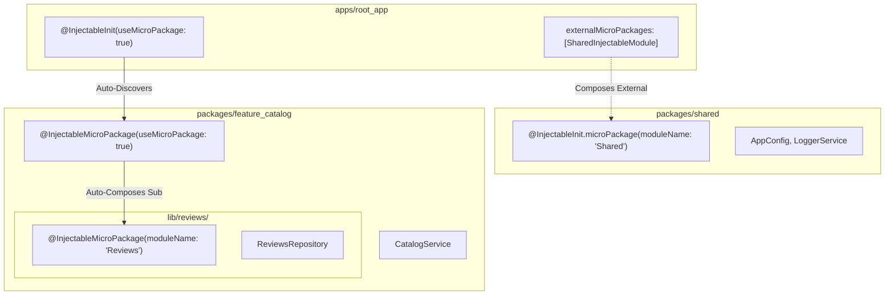
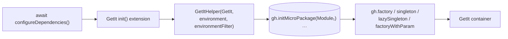

# injectable_codegen & injectable — Complete Architecture & Reference

> **Injectable** is a code-generation dependency injection toolkit for Dart and
> Flutter built on top of [GetIt](https://pub.dev/packages/get_it).
>
> The key differentiator is **Folder-Scoped Micro-Packages**: you can scope
> a folder (e.g. `lib/features/orders/`) into its own isolated module with
> `@InjectableMicroPackage`, and compose it with other modules either explicitly
> or automatically — at the root container or inside another micro-package.

---

## 1. Monorepo & Package Structure

```
injectable-dart/
├── packages/
│   ├── injectable/                  # Runtime package
│   │   ├── lib/
│   │   │   ├── injectable.dart      # Public exports
│   │   │   └── src/
│   │   │       ├── annotations/     # @Injectable, @InjectableInit, @InjectableMicroPackage, etc.
│   │   │       └── module/          # MicroPackageModule, GetItHelper, EnvironmentFilter
│   │   └── test/
│   └── injectable_codegen/          # Code generator (build_runner)
│       ├── lib/
│       │   ├── builder.dart         # SharedPartBuilder / LibraryBuilder entry points
│       │   └── src/
│       │       ├── generator/       # InjectableGenerator, micro-package scanners
│       │       ├── scanner/         # Library scanner, AST visitor, boundary filters
│       │       ├── parser/          # AnnotationParser, DependencyParser
│       │       ├── model/           # DependencyInfo, ModuleInfo, ImportAliasRegistry
│       │       └── emitter/         # RegistrationEmitter, ModuleClassEmitter, ImportEmitter
│       └── test/
└── examples/
    └── demo_monorepo/               # Multi-package testbed
        ├── packages/
        │   ├── shared/              # Shared external micro-package
        │   └── feature_catalog/     # Multi-level nested micro-package
        └── apps/
            └── root_app/            # Root container app with external composition
```

---

## 2. Micro-Package Architecture & Scoping

Micro-packages allow large Dart/Flutter codebases to partition their dependency
graph into small, self-contained, re-usable units.



### Key Scoping Rules

1. **Folder Boundary Isolation**: When `@InjectableMicroPackage` is placed on
   a file in a sub-folder (e.g. `lib/features/auth/auth_module.dart`), any
   dependencies defined in that folder and its child folders belong **exclusively**
   to that micro-package. Sibling folders and the root generator ignore them.
2. **Deterministic Composition**: Nested micro-packages are auto-discovered when
   `useMicroPackage: true` is specified. Circular compositions are prevented by
   depth-first topological ordering, ensuring each module is registered exactly once.
3. **Cross-Package Composition**: For dependencies across `pubspec.yaml`
   boundaries, `externalMicroPackages: [ExternalMicroPackage(ModuleType)]`
   wires the external module inside the generated `init()` without requiring manual
   extension invocation.

---

## 3. The 6-Stage Generation Pipeline


1. **Scanner**: Scans the target library using `analyzer` AST and element models.
2. **Boundary Filter**: Excludes files that reside in sub-directories possessing
   their own `@InjectableMicroPackage`.
3. **Parser**: Extracts constructors, `@FactoryParam`, `@Inject`, `@Environment`,
   `@Order`, and lifecycle scopes (`Scope.factory`, `Scope.singleton`, `Scope.lazySingleton`).
4. **Import Alias Registry**: Normalizes package URIs, avoids namespace collisions,
   and assigns deterministic prefix aliases (`_i1`, `_i2`, etc.).
5. **Graph Sorter**: Performs a stable topological sort respecting `dependsOn`,
   registration order, and synchronous/asynchronous pre-resolution order.
6. **Emitter**: Produces clean, readable Dart code implementing `MicroPackageModule`
   or the top-level `GetIt` extension.

---

## 4. Code Generation Rules & Mechanics

- **No Reflection**: All graph wiring is purely static and resolved through
  constructor arguments looked up from the `GetItHelper` (`gh<T>()`).
- **Async Safety**: Asynchronous singletons (`Future<T>`) and `@PreResolve`
  dependencies are generated with `await gh.singletonAsync<T>()`, and the
  resulting `init()` extension method is automatically promoted to `Future<GetIt>`.
- **Environment Gating**: Dependencies annotated with `@Environment('name')`
  are wrapped in conditional predicates executed against the active `EnvironmentFilter`.

---

## 5. Micro-Package Declaration Examples

### Root Application

```dart
// lib/injection.dart
import 'package:get_it/get_it.dart';
import 'package:injectable/injectable.dart';
import 'package:shared/shared_module.config.dart';

import 'injection.config.dart';

final getIt = GetIt.instance;

@InjectableInit(
  initializerName: 'init',
  preferRelativeImports: true,
  asExtension: true,
  useMicroPackage: true,
  externalMicroPackages: [
    ExternalMicroPackage(SharedInjectableModule),
  ],
)
Future<void> configureDependencies({String? environment}) async =>
    getIt.init(environment: environment);
```

### Folder Micro-Package

```dart
// lib/features/auth/auth_module.dart
import 'package:injectable/injectable.dart';

@InjectableMicroPackage(
  moduleName: 'Auth',
  initializerName: 'initAuth',
)
void configureAuthModule() {}
```

---

## 6. Supported Annotations

| Annotation                    | Target                | Description                                              |
| :---------------------------- | :-------------------- | :------------------------------------------------------- |
| `@Injectable()`               | Class, Method         | Marks a class or factory method for DI registration      |
| `@InjectableInit()`           | Function              | Root container initialization entrypoint                 |
| `@InjectableMicroPackage()`   | Function              | Folder-scoped or package-scoped micro-package entrypoint |
| `@ExternalMicroPackage(Type)` | Annotation Parameter  | References an external module class to compose           |
| `@ExternalModule()`           | Abstract Class        | Third-party provider module with getters/methods         |
| `@Inject('tag')`              | Parameter             | Named / tagged dependency lookup qualifier               |
| `@FactoryParam()`             | Constructor Parameter | Dynamic parameter passed at resolution time              |
| `@FactoryMethod()`            | Method / Constructor  | Factory instantiator for the dependency                  |
| `@PreResolve()`               | Method / Getter       | Awaits asynchronous singleton completion during init     |
| `@Environment('env')`         | Class, Method         | Restricts registration to specific environments          |
| `@Order(int)`                 | Class, Method         | Sets explicit registration ordering priority             |
| `@DisposeMethod()`            | Instance Method       | Cleanup hook invoked on container reset                  |

---

## 7. Registration Scopes

| Scope                     | Description                                            | GetIt Target                     |
| :------------------------ | :----------------------------------------------------- | :------------------------------- |
| `Scope.factory` (default) | New instance created on every lookup                   | `gh.factory<T>(() => ...)`       |
| `Scope.lazySingleton`     | Single shared instance instantiated on first lookup    | `gh.lazySingleton<T>(() => ...)` |
| `Scope.singleton`         | Single shared instance instantiated eagerly at startup | `gh.singleton<T>(...)`           |

---

## 8. What the emitted code looks like

Real output from `examples/demo_monorepo/apps/root_app/lib/injection.config.dart`:

```dart
// GENERATED CODE - DO NOT MODIFY BY HAND
import 'package:injectable/injectable.dart' as _i1;
import 'package:get_it/get_it.dart' as _i2;
import 'package:shared/shared_module.config.dart' as _i3;
import 'package:feature_catalog/catalog_module.config.dart' as _i4;
import 'package:root_app/startup_service.dart' as _i5;

extension GetItInjectableX on _i2.GetIt {
  _i2.GetIt init({...}) {
    final gh = _i1.GetItHelper(this, ...);
    gh.initMicroPackage(_i3.SharedInjectableModule());   // external, in order
    gh.initMicroPackage(_i4.CatalogInjectableModule());  // auto-composes reviews
    gh.lazySingleton<_i5.StartupService>(() => _i5.StartupService(gh<_i6.AppConfig>()));
    return this;
  }
}
```

Constructor parameters become locator lookups (`gh<T>()`), so the generated
code never constructs the dependency graph by hand — it resolves from `GetIt`.

---

## 9. Runtime machinery (`packages/injectable`)



- `GetItHelper` wraps every registration with `_canRegister(registerFor)` — environment filtering (`NoEnvOrContains`, `NoEnvOrContainsAll`, `SimpleEnvironmentFilter`).
- `MicroPackageModule.init(GetItHelper)` is the composition contract every generated module implements.
- Async (`@PreResolve`) singletons are emitted as `await gh.singletonAsync<T>(() async => ...)`. GetIt starts the factory eagerly; the registration stays **pending** until the factory's future completes — `getIt<T>()` throws `StateError` until then. Resolve via `await getIt.getAsync<T>()` (one) or `await getIt.allReady()` (all). Generators that only construct synchronously (plain class) complete after a microtask; genuinely-future-producing factories stay pending.

---

## 10. Annotation conventions

- **Use class-form annotations only** (`@Injectable()`, `@InjectableInit(...)`, `@InjectableMicroPackage(...)`, `@ExternalModule()`, `@FactoryParam()`).
- Const-variable annotations (`@injectable`, `@externalModule`, …) are **not** provided: Dart annotations with arguments must be constructor invocations, and a const variable cannot be invoked with arguments — one style, no confusion.
- `Scope` values use explicit enum members: `scope: Scope.singleton`, `scope: Scope.lazySingleton`, `scope: Scope.factory`.
- No deprecated aliases are kept.

---

## 11. Regeneration

```bash
# in any package that uses injectable_codegen
dart run build_runner build
# or, after generator changes
dart run build_runner build --delete-conflicting-outputs
```
