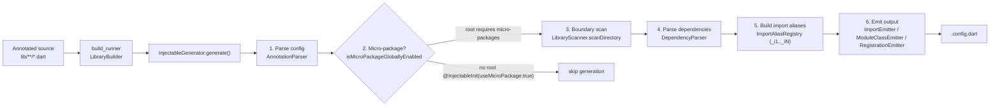
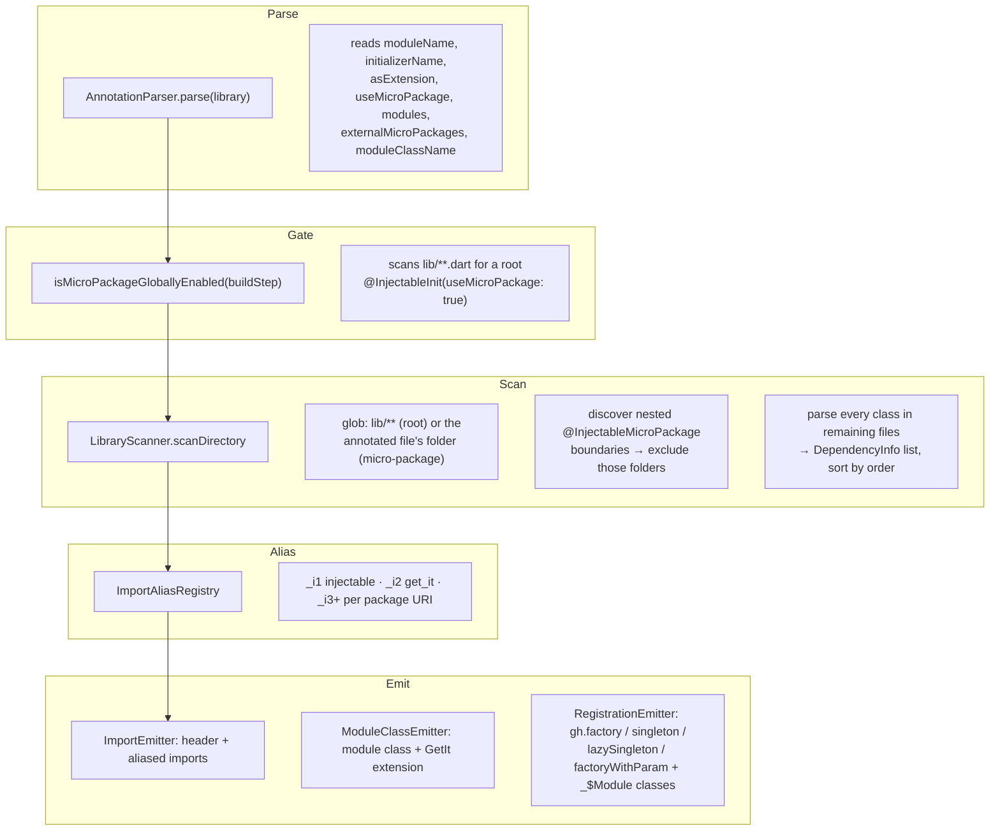
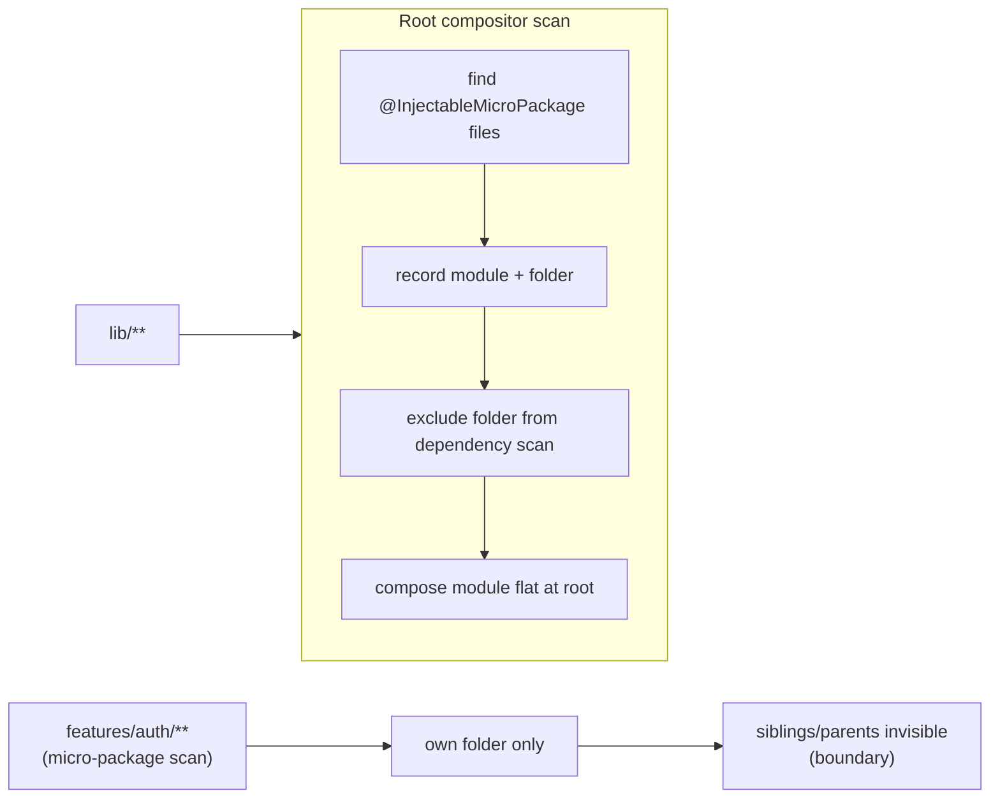
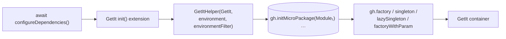

# Injectable Codegen — How It Works

> How the local `injectable` + `injectable_codegen` packages turn annotated
> source files into `GetIt` initialization code.

---

## 1. The two packages

| Package | Role |
|---|---|
| `packages/injectable` | **Runtime**: annotations (`@Injectable`, `@InjectableInit`, `@InjectableMicroPackage`, `@ExternalModule`, …), `Scope` enum, `MicroPackageModule` base class, `GetItHelper` (environment-gated registration wrapper around `GetIt`) |
| `packages/injectable_codegen` | **Build-time**: a `build_runner` generator (`build.yaml` → `builder.dart` → `InjectableGenerator`) that scans source, parses annotations, and emits `<file>.config.dart` next to the annotated entry file |

Consumers add `injectable` to dependencies and `injectable_codegen` + `build_runner` to dev dependencies, then run:

```bash
dart run build_runner build
```

---

## 2. High-level pipeline



**Output shape depends on the mode** (see §5):

- Monolithic/root compositor → a GetIt **extension** (`GetItInjectableX`) with an `init()` method.
- Folder micro-package → a **`MicroPackageModule` subclass** (`XInjectableModule`) plus an extension (`XInjectableModuleX`).

---

## 3. Build setup (`injectable_codegen/build.yaml`)

```yaml
builders:
  injectable_generator:
    import: "package:injectable_codegen/builder.dart"
    builder_factories: ["injectableBuilder"]
    build_extensions: {".dart": [".config.dart"]}
    auto_apply: dependents
    build_to: source
```

- `LibraryBuilder(InjectableGenerator, generatedExtension: '.config.dart')` runs the generator once per `.dart` file in the package.
- `build_to: source` means generated files are written **into `lib/`** and committed (the examples in this repo check them in).
- Only files annotated with `@InjectableInit` / `@InjectableMicroPackage` produce output; the generator returns `null` for everything else.

---

## 4. The generator stages in detail



Key behaviors:

- **AST fallbacks** — every stage has a primary `TypeChecker`/`ConstantReader` path and a best-effort AST fallback (used when constant resolution is unavailable). Fallbacks match annotation *class names* (`InjectableInit`, `InjectableMicroPackage`, …).
- **Boundary isolation** — a micro-package's scan glob is its own folder; nested sub-module folders are discovered and **excluded** from the parent's dependency scan. Sub-modules are composed separately (see §5).
- **Generated-file skipping** — assets ending in `.config.dart` / `.injectable.dart` are never re-scanned.

---

## 5. Composition modes

```mermaid
flowchart TB
    subgraph Monolithic
        M1["@InjectableInit() plain"] --> M2["extension GetItInjectableX { init() }<br/>registers own lib/** deps"]
    end
    subgraph RootCompositor
        R1["@InjectableInit(useMicroPackage: true)"] --> R2["scans lib/**, discovers ALL folder<br/>micro-packages, excludes their folders"] --> R3["init() → gh.initMicroPackage(Sub₁…) flat"]
    end
    subgraph FolderMicro
        F1["@InjectableMicroPackage(moduleName: 'X')"] --> F2["generates XInjectableModule<br/>+ extension XInjectableModuleX"]
    end
    subgraph ModuleCompositor
        MC1["@InjectableMicroPackage(useMicroPackage: true)"] --> MC2["XInjectableModule.init() registers own deps<br/>then gh.initMicroPackage(NestedSub())"]
    end
    subgraph External
        E1["@InjectableInit(externalMicroPackages: [<br/>ExternalMicroPackage(SharedModule), …])"] --> E2["init() → gh.initMicroPackage(T₁());<br/>… in declaration order"]
    end
```



| Mode | Annotation | Emitted composition |
|---|---|---|
| Monolithic root | `@InjectableInit()` | own dependencies only |
| Root compositor | `@InjectableInit(useMicroPackage: true)` | every discovered folder micro-package, **flat** at root |
| Folder micro-package | `@InjectableMicroPackage(...)` | own folder deps only (isolated) |
| Module compositor | `@InjectableMicroPackage(useMicroPackage: true)` | own deps + nested sub-modules, inside `init()` |
| External composition | `ExternalMicroPackage(ModuleType)` in `externalMicroPackages:` | `gh.initMicroPackage(T())` per entry, in order, before local registrations |

> Rule: **compose each module exactly once** — either the parent composes a
> nested sub-module (`useMicroPackage: true`), or the app composes it
> explicitly — not both, or `GetIt` throws on double registration.

---

## 6. Scanning & boundaries



- `isMicroPackageGloballyEnabled` stops **redundant** generation when a root initializer with `useMicroPackage: false` exists.
- Folder exclusion works at any depth: `features/cart/checkout` nested inside `features/cart` — each boundary is its own module.
- `externalMicroPackages` bridges the one gap scanning cannot solve: modules that live in **another pubspec** are invisible to this package's `findAssets` scan, so they are referenced by type instead.

---

## 7. Dependency parsing rules (`DependencyParser`)

| Source element | Parsed into |
|---|---|
| `@Injectable(scope: Scope.singleton \| lazySingleton \| factory)` | `DependencyKind` + registration call |
| `@Injectable(as: SomeInterface)` | bound type (registered as the interface) |
| `@Inject('tag')` on class/param/getter | `instanceName` — GetIt named lookup/tag |
| `@FactoryParam` on constructor param | resolved at **call time** (`factoryWithParam`) instead of from the locator |
| `@FactoryMethod` | choose this constructor/method as the factory |
| `@PreResolve` / `Future` return | async registration (`singletonAsync`) |
| `@Environment('dev')` / `@dev` / env list | `registerFor: {...}` gating via `EnvironmentFilter` |
| `@Order(n)` / `order:` | dependency sort priority (0 default) |
| `@DisposeMethod` / `dispose:` | dispose callback on the registration |
| `@ExternalModule()` | every public getter/method becomes a dependency; the class is instantiated once as `_$Module` |

> **Dot-shorthand scope:** `scope:` accepts Dart's enum dot-shorthand (SDK
> 3.10+) — `@Injectable(scope: .lazySingleton)` is identical to
> `@Injectable(scope: Scope.lazySingleton)`. The parser resolves the enum
> member either way (`Scope.lazySingleton` → `lazySingleton` kind).

---

## 8. What the emitted code looks like

Real output from `examples/demo_monorepo/apps/root_app/lib/injection.config.dart`:

```dart
// GENERATED CODE - DO NOT MODIFY BY HAND
import 'package:injectable/injectable.dart' as _i1;
import 'package:get_it/get_it.dart' as _i2;
import 'package:shared/shared_module.config.dart' as _i3;
import 'package:feature_catalog/catalog_module.config.dart' as _i4;
import 'package:root_app/startup_service.dart' as _i5;

extension GetItInjectableX on _i2.GetIt {
  _i2.GetIt init({...}) {
    final gh = _i1.GetItHelper(this, ...);
    gh.initMicroPackage(_i3.SharedInjectableModule());   // external, in order
    gh.initMicroPackage(_i4.CatalogInjectableModule());  // auto-composes reviews
    gh.lazySingleton<_i5.StartupService>(() => _i5.StartupService(gh<_i6.AppConfig>()));
    return this;
  }
}
```

Constructor parameters become locator lookups (`gh<T>()`), so the generated
code never constructs the dependency graph by hand — it resolves from `GetIt`.

---

## 9. Runtime machinery (`packages/injectable`)



- `GetItHelper` wraps every registration with `_canRegister(registerFor)` — environment filtering (`NoEnvOrContains`, `NoEnvOrContainsAll`, `SimpleEnvironmentFilter`).
- `MicroPackageModule.init(GetItHelper)` is the composition contract every generated module implements.
- Async (`@PreResolve`) singletons are emitted as `await gh.singletonAsync<T>(() async => ...)`. GetIt starts the factory eagerly; the registration stays **pending** until the factory's future completes — `getIt<T>()` throws `StateError` until then. Resolve via `await getIt.getAsync<T>()` (one) or `await getIt.allReady()` (all). Generators that only construct synchronously (plain class) complete after a microtask; genuinely-future-producing factories stay pending.

---

## 10. Annotation conventions

- **Use class-form annotations only** (`@Injectable()`, `@InjectableInit(...)`, `@InjectableMicroPackage(...)`, `@ExternalModule()`, `@FactoryParam()`).
- Const-variable annotations (`@injectable`, `@externalModule`, …) are **not** provided: Dart annotations with arguments must be constructor invocations, and a const variable cannot be invoked with arguments — one style, no confusion.
- `Scope` values accept Dart's enum dot-shorthand: `scope: .singleton` ≡ `scope: Scope.singleton`.
- No deprecated aliases are kept.

---

## 11. Regeneration

```bash
# in any package that uses injectable_codegen
dart run build_runner build
# or, after generator changes
dart run build_runner build --delete-conflicting-outputs
```

Generated `.config.dart` files are committed in this repo's examples
(`examples/micro_package_example`, `examples/demo_monorepo`).

---

## Known limitations

- `generateForDir` is declared but not honored by the scanner (globs are hardcoded: `lib/**` for roots, the annotated file's folder for micro-packages).
- AST fallbacks are best-effort; cross-package details (import URIs) are only guaranteed via the primary constant-resolution path.
- Nested sub-module calls inside a module's `init()` are emitted without `await` (works for synchronous modules; `FutureOr` is tolerated).
