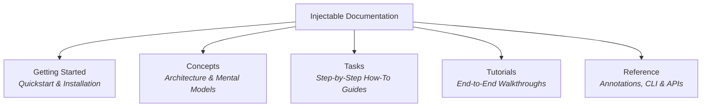

# Injectable Documentation Site (Hugo + Docsy)

This directory contains the official documentation website for **Injectable**, built using the same documentation framework and theme as **Kubernetes Docs** (**Hugo Extended** + **Google Docsy Theme**).

---

## 🚀 Running the Documentation Locally

### 1. Prerequisites

- **Hugo Extended** (`v0.160+`):
  ```bash
  brew install hugo
  ```
- **Node.js** (`v18+`) & **npm**:
  ```bash
  cd docs
  npm install
  ```

### 2. Start the Local Server

```bash
cd docs
npm run serve
# or directly:
hugo server --disableFastRender
```

Navigate to `http://localhost:1313/` in your browser. Live reloading is enabled by default.

### 3. Build Static HTML

```bash
cd docs
npm run build
# or:
hugo --minify
```

The compiled static site will be output to `docs/public/`.

---

## 📁 Site Architecture & Directory Structure

```
docs/
├── hugo.toml                 # Hugo & Docsy configuration
├── package.json              # Docsy asset dependencies (Bootstrap 5, FontAwesome, PostCSS)
├── go.mod                    # Hugo Go module dependencies (github.com/google/docsy/theme)
├── content/                  # Documentation source content
│   ├── _index.md             # Landing / Home page with hero banner & feature blocks
│   └── docs/                 # Main documentation hierarchy
│       ├── _index.md         # Documentation portal overview
│       ├── getting-started/  # Installation, Quickstart, Monorepo Setup
│       ├── concepts/         # Architecture, Scopes, Micro-Packages, Environments
│       ├── tasks/            # How-to guides (Root Container, Async, Third-Party)
│       ├── tutorials/        # Modular Flutter App, Multi-Package Monorepo
│       └── reference/        # Annotations Reference, Build Config, Runtime API
└── public/                   # Compiled static HTML output (generated on build)
```

---

## 🧭 Documentation Map (Diátaxis Framework)



| Section                                                       | Description                                                | Key Topics                                                                                                                                                                                                                                                                                                                                                                 |
| :------------------------------------------------------------ | :--------------------------------------------------------- | :------------------------------------------------------------------------------------------------------------------------------------------------------------------------------------------------------------------------------------------------------------------------------------------------------------------------------------------------------------------------- |
| [**Getting Started**](content/docs/getting-started/_index.md) | Install and run Injectable in minimal steps.               | [Installation](content/docs/getting-started/installation.md), [Quickstart](content/docs/getting-started/quickstart.md), [Monorepo Setup](content/docs/getting-started/monorepo-setup.md)                                                                                                                                                                                   |
| [**Concepts**](content/docs/concepts/_index.md)               | Understand the architecture and principles of Injectable.  | [Architecture](content/docs/concepts/architecture.md), [Scopes & Lifecycles](content/docs/concepts/scopes-and-lifecycles.md), [Micro-Packages](content/docs/concepts/micro-packages.md), [Environments](content/docs/concepts/environments-and-filtering.md), [Async & PreResolve](content/docs/concepts/async-and-preresolve.md)                                          |
| [**Tasks**](content/docs/tasks/_index.md)                     | Goal-oriented, step-by-step guides for everyday workflows. | [Root Container](content/docs/tasks/configure-root-container.md), [Folder Micro-Packages](content/docs/tasks/declare-folder-micro-packages.md), [External Modules](content/docs/tasks/compose-external-micro-packages.md), [Factory Parameters](content/docs/tasks/work-with-factory-parameters.md), [Third-Party Types](content/docs/tasks/register-third-party-types.md) |
| [**Tutorials**](content/docs/tutorials/_index.md)             | Hands-on, practical scenarios from start to finish.        | [Modular Flutter App](content/docs/tutorials/modular-flutter-app.md), [Multi-Package Monorepo](content/docs/tutorials/multi-package-monorepo.md)                                                                                                                                                                                                                           |
| [**Reference**](content/docs/reference/_index.md)             | Comprehensive API and technical specifications.            | [Annotations Reference](content/docs/reference/annotations.md), [Build Configuration](content/docs/reference/build-configuration.md), [Runtime API](content/docs/reference/runtime-api.md), [Glossary](content/docs/reference/glossary.md)                                                                                                                                 |
