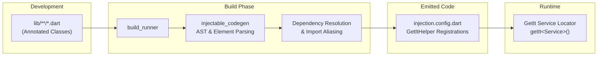

Welcome to the **Injectable** documentation. Injectable is a compile-time, code-generated dependency injection toolkit for Dart and Flutter, built on top of `GetIt`. It provides folder-scoped micro-packages, cross-package composition, environment gating, and pure class-form annotations without magic or runtime reflection.

This documentation follows the **Diátaxis framework** adopted by modern engineering ecosystems such as Kubernetes.

---

## Documentation Map

| Section | Description | Key Topics |
| :--- | :--- | :--- |
| [**Getting Started**](getting-started/) | Install and run Injectable in minimal steps. | [Installation](getting-started/installation/), [Quickstart](getting-started/quickstart/), [Monorepo Setup](getting-started/monorepo-setup/) |
| [**Concepts**](concepts/) | Understand the architecture and mental models. | [Architecture](concepts/architecture/), [Scopes & Lifecycles](concepts/scopes-and-lifecycles/), [Micro-Packages](concepts/micro-packages/), [Environments](concepts/environments-and-filtering/), [Async & PreResolve](concepts/async-and-preresolve/) |
| [**Tasks**](tasks/) | Goal-oriented, step-by-step how-to recipes. | [Root Container](tasks/configure-root-container/), [Folder Micro-Packages](tasks/declare-folder-micro-packages/), [External Modules](tasks/compose-external-micro-packages/), [Factory Parameters](tasks/work-with-factory-parameters/), [Third-Party Types](tasks/register-third-party-types/) |
| [**Tutorials**](tutorials/) | Hands-on, practical scenarios from start to finish. | [Modular Flutter App](tutorials/modular-flutter-app/), [Multi-Package Monorepo](tutorials/multi-package-monorepo/) |
| [**Reference**](reference/) | Comprehensive API and technical specifications. | [Annotations Reference](reference/annotations/), [Build Configuration](reference/build-configuration/), [Runtime API](reference/runtime-api/), [Glossary](reference/glossary/) |

---

## High-Level Architecture Overview

Injectable operates as a dual-package system:

1. **`injectable` (Runtime Library)**: Contains annotations (`@Injectable`, `@InjectableInit`, `@InjectableMicroPackage`, `@ExternalModule`, `@Inject`, etc.), the `Scope` enumeration, `MicroPackageModule` interface, and `GetItHelper` wrapper.
2. **`injectable_codegen` (Build Generator)**: A `build_runner` code generator that parses annotated Dart libraries, analyzes dependency graphs, and produces type-safe, collision-free `.config.dart` initialization files.

---

## Core Advantages

- **Zero Boilerplate Wiring**: Constructor parameters are automatically resolved from the locator (`gh<T>()`), eliminating manual graph assembly.
- **Folder-Scoped Micro-Packages**: Isolate feature folders with `@InjectableMicroPackage` so dependencies belong strictly to their domain.
- **Cross-Pubspec Composition**: Seamlessly compose modules from other packages in a monorepo via `externalMicroPackages`.
- **Compile-Time Safety**: Code generation happens before compile time, eliminating reflective overhead and runtime lookup failures.
- **Class-Form Annotations**: Pure Dart class annotations with dot-shorthand enum syntax (`@Injectable(scope: .lazySingleton)`).
